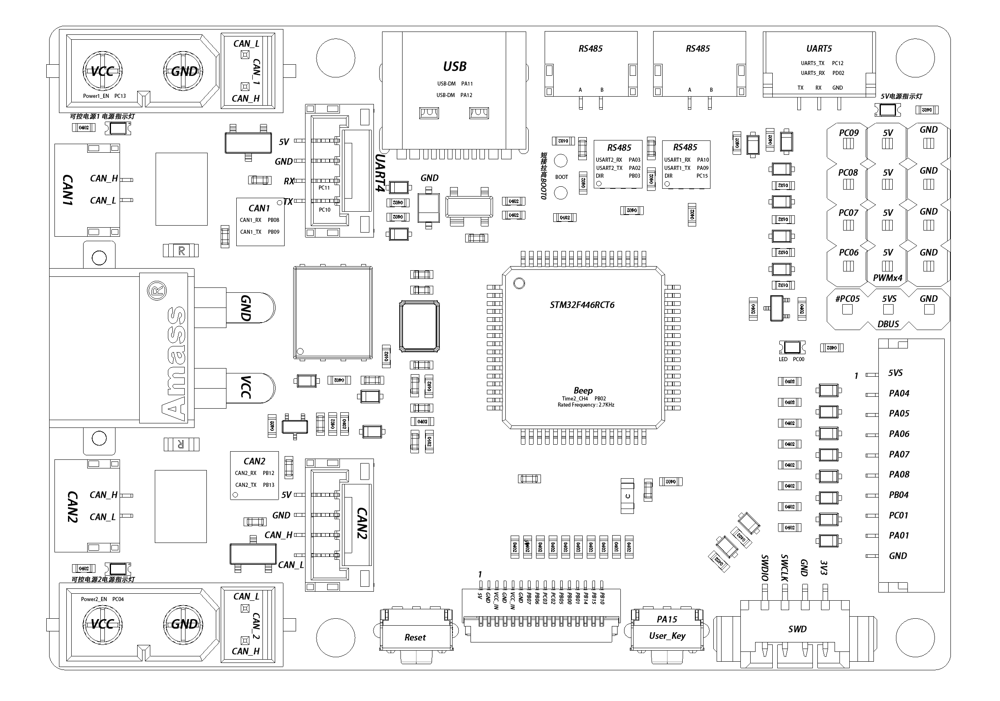

# 达妙接线说明

## 达妙管教配置说明图

## 下C接线说明

下C主要负责底盘控制以及遥控器数据的接收工作

对于底盘控制 主要通过CAN2连接至接线板 通过接线板将CAN2信号传递给各个电机 各个电机的ID已经提前设定

对于遥控器数据的接收 主要通过USART3 在达妙控制板上为DBUS接口

下C同时需要负责将遥控器数据传输给上C 数据传输主要通过USART1实现 上C接收也是通过USART1来实现

## 上C接线说明

上C主要负责机械臂各个电机的控制 无刷电机的PWM控制 以及6002的z轴控制 同时需要负责接受as5600 上位机 以及下C发送的USART数据

对于机械臂的电机控制 从内到外电机分别为 `CAN1_MOTOR1 CAN2_MOTOR3 CAN2_MOTOR2 CAN2_MOTOR1` 对于`CAN1_MOTOR1` 需要连接CAN1信号线 对于 `CAN2_MOTOR3 CAN2_MOTOR2 CAN2_MOTOR`则需要连接CAN2信号线 在此就不过多赘述

对于无刷电机的PWM控制 代码主要通过控制TIM8_CHANNEL3来实现控制 即说明图中的PC09 5V GND接线

对于as5600的数据接收 主要通过SPI来实现远距离通信 但是目前来看C版的SPI读取移植尚未成功

对于上位机数据的接收主要通过USART2来实现 通过USB-TTL模块来实现与上位机的通信

对于下C发送的遥控器数据 我们通过USART1来接收

具体的走线维护方案会在后期更新 以便于工程的维护 另外 达妙的代码目前没有进行实际测试 仅仅是通过C版的旧代码移植而来 等待硬件到位以后进行更细致的更改

[达妙官方例程以及原理图地址](https://gitee.com/kit-miao/damiao/tree/master/%E6%8E%A7%E5%88%B6%E6%9D%BF/DM_MC)